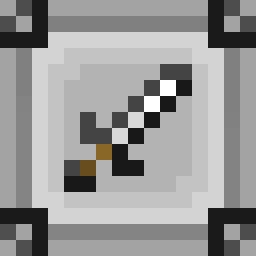

<div align="center">
  

[](LICENSES/MIT.txt)
[](LICENSES/CC-BY-NC-SA-4.0.txt)
[](https://discord.gg/dAcghG992N)

</div>

**Java Mechanics** is a fork of Sweep 'N that introduces some of the more niche mechanics in Java and adds its combat. It is based on the original Sweep 'N Slash project; original authorship and licensing remain credited in [NOTICE.md](NOTICE.md).

# Cross-Compatibility

This project uses [MCBE-IPC](https://github.com/OmniacDev/MCBE-IPC) for Cross-compatibility. It allows the add-on to have item stats defined by receiving script events of item data from external behavior packs. This eliminates the hassle of having to modify the add-on's internal data.

# Development

This project uses [Regolith](https://github.com/Bedrock-OSS/regolith) as its build pipeline.

## Prerequisites

| Tool                                                         | Purpose                                                                                                                                                                                                                                                                                          |
| ------------------------------------------------------------ | ------------------------------------------------------------------------------------------------------------------------------------------------------------------------------------------------------------------------------------------------------------------------------------------------ |
| [Regolith](https://github.com/Bedrock-OSS/regolith/releases) | Build pipeline runner                                                                                                                                                                                                                                                                            |
| [Node.js](https://nodejs.org/)                               | Required by the [`gametests`](https://github.com/Bedrock-OSS/regolith-filters/tree/master/gametests) filter for TypeScript compilation                                                                                                                                                           |
| [Deno](https://deno.com/)                                    | Required by the [`marathon`](https://github.com/azurite-bedrock/regolith-filters/tree/main/marathon), [`shush`](https://github.com/azurite-bedrock/regolith-filters/tree/main/shush) and [`parcel`](https://github.com/azurite-bedrock/regolith-filters/tree/main/parcel) filters (from Azurite) |

## Setup

Install filter dependencies:

```sh
regolith install-all
```

## Profiles

All profiles export to `com.mojang/development_*_packs` unless noted otherwise.

| Profile         | JSON     | Scripts               | Notes                                                  |
| --------------- | -------- | --------------------- | ------------------------------------------------------ |
| `dev`           | Pretty   | Bundled, not minified | Day-to-day development                                 |
| `dev-gametest`  | Pretty   | Bundled, not minified | Development with `@minecraft/server-gametest`          |
| `pack`          | Minified | Bundled, minified     | Outputs a versioned `JavaMechanics-*.mcaddon`          |
| `pack-gametest` | Minified | Bundled, minified     | Outputs a versioned `JavaMechanics-*-gametest.mcaddon` |

### Running a profile

```sh
regolith run <profile>
```

For example:

```sh
regolith run dev
regolith run pack
```

For automatic development exports, run `Regolith: Watch development with GameTest` from the VS Code Tasks menu. The workspace is configured to start this watcher when opened; changes under `packs/` are rebuilt and exported to Minecraft's development pack folders.

# Licensing

This project uses a dual-license model. See [NOTICE.md](NOTICE.md) for full details.

| Component               | License                                         |
| ----------------------- | ----------------------------------------------- |
| Code, scripts, and data | [MIT](LICENSES/MIT.txt)                         |
| Project icon and logo   | [CC-BY-NC-SA-4.0](LICENSES/CC-BY-NC-SA-4.0.txt) |

See [TRADEMARK.md](TRADEMARK.md) for the trademark policy. Trademark rights exist independently of, and are not granted by, either license.

By contributing you agree to the licensing terms described in [docs/CONTRIBUTING.md](docs/CONTRIBUTING.md).
